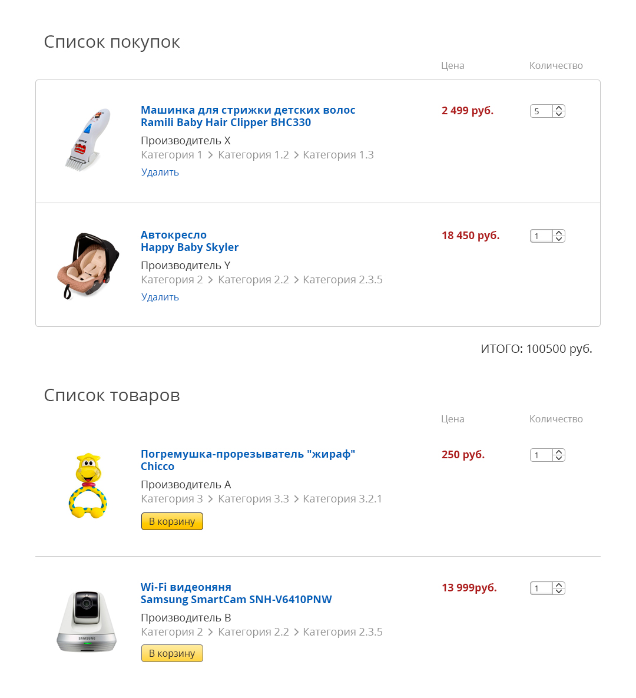

Тестовое задание Full Stack
===

Задание 1: база данных
---
Спроектировать БД (можно в любом виде - таблицами, схемой, SQL-файлом). Есть сайт интернет-магазина. Там есть **категории**, которые могут быть вложены друг в друга. В категориях находятся **товары**. На сайте также есть личный кабинет. В нем могут зарегистрироваться **пользователи**. У пользователя есть **заказы**, в которых есть товары.

Задание 2: корзина
---

Сделать отдельный ни с чем не связанный элемент "Корзина". В корзине можно добавлять, удалять позиции в заказ. Информация о добавленных в корзину товарах должна сохраняться на сервере для каждого пользователя.

### Визуальная часть

Корзина разделена на 2 части - сверху - товары, которые находятся в корзине пользователя, снизу - товары, которые можно добавить в корзину. 

С помощью кнопок "Удалить" и "Добавить" можно убирать и добавлять товар в заказ соответственно.

С помощью input'a "Количество" можно менять количество товаров в заказе (или количество добавляемых в заказ товаров).  Input "Количество" можно сделать системным элементом `<select>`, но дополнительным плюсом будет сделать его таким, как на эскизе.

У товара есть категории, причём вложенность категорий неограничена. На странице это только декоративный элемент, он не должен обладать никаким функционалом (за исключением того, что данные о категории необходимо брать из базы данных).

* Эскиз в PSD находится в папке `/design`
* Внешний вид кнопок при наведении можно посмотреть в PSD-файле
* Чёткое соответствие эскизам очень важно, именно по этому критерию будет оцениваться визуальная часть задания.
* Результат должен быть Responsive. То, как внешний вид изменяется на мобильных разрешениях, нужно придумать по своему вкусу.

### Техническая часть

* Серверная часть задания должна быть выполнена на PHP без использования Framework'ов
* Клиентская часть должна быть выполнена без Framework'ов, однако разрешается использование jQuery и Bootstrap
* Административную часть делать не нужно, данные должны браться из базы данных MySQL/MariaDB, куда их можно внести вручную.
* Данные о категориях и товарах должны храниться в базе данных и загружаться оттуда при загрузке корзины
* Нужно сделать хранение данных о заказе следующим образом. При входе на страницу, нужно присвоить пользователю уникальный ID в Cookie (можно для этого использовать PHP-сессии). Если пользователь не новый, то загрузить его список покупок. При изменении информации о заказе необходимо в базе данных сохранять информацию о соответствии ID пользователя и списка покупок.
* Выполненное тестовое задание обязательно нужно разместить на каком-либо хостинге. Можно использовать для этого бесплатный хостинг https://www.000webhost.com/